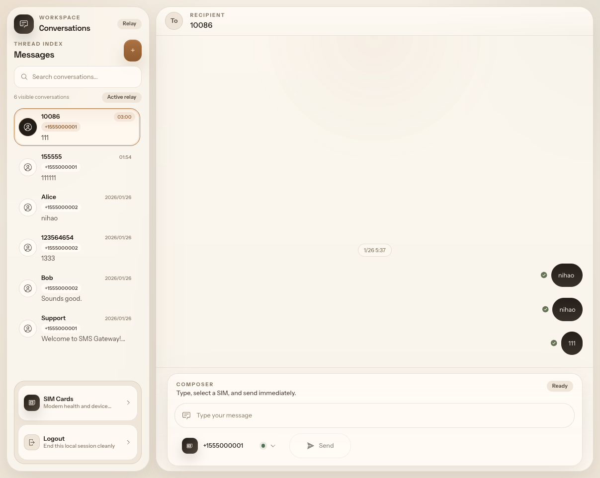
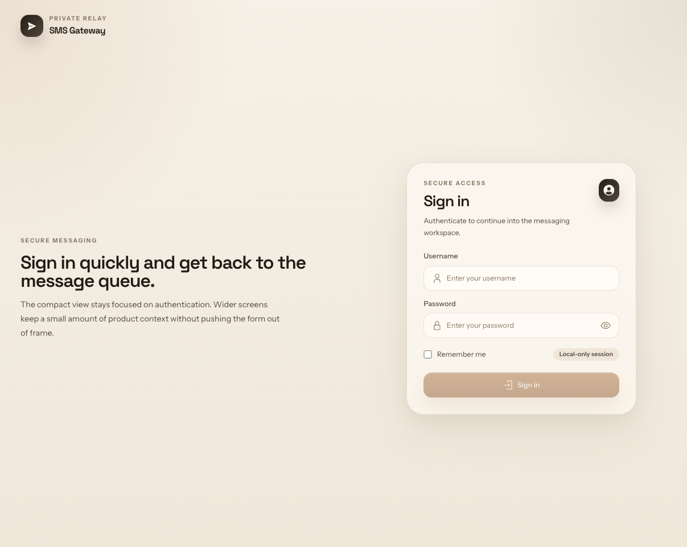
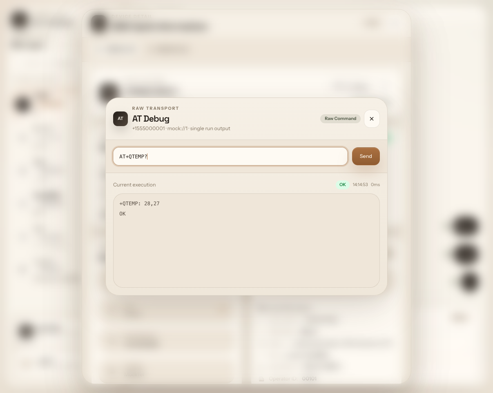

# SMS Gateway

SMS Gateway is a self-hosted web workspace for handling SMS traffic across multiple modems and SIM cards. It keeps conversations, SIM status, and device controls in one place so you can reply faster, monitor line health, and hand messages off to the rest of your stack.

## Why SMS Gateway

- Keep inbound and outbound SMS in a clean, conversation-first workspace.
- Manage multiple SIM cards without losing per-device visibility.
- Check signal, operator, storage, and health status from the same UI.
- Forward messages into your own workflows with webhook support.
- Use raw AT debugging when a device needs closer inspection.

## Interface Preview

### Conversation Workspace

<p align="center">
  
</p>

### More Screens

<table>
  <tr>
    <td width="50%">
      
    </td>
    <td width="50%">
      
    </td>
  </tr>
  <tr>
    <td align="center"><sub>Secure Login</sub></td>
    <td align="center"><sub>SIM Detail and AT Debug</sub></td>
  </tr>
</table>

## Quick Start

1. Copy the example configuration:

```bash
cp config.toml.example config.toml
```

2. Build the frontend:

```bash
cd frontend
pnpm install
pnpm run build
```

3. Start the server:

```bash
cargo run --release -- --config ./config.toml
```

4. Open `http://localhost:8080` in your browser.

## Configuration

- Start with [`config.toml.example`](./config.toml.example).
- Add your modem ports under `[[devices]]`.
- Set the web login, polling interval, and webhook behavior under `[settings]`.
- Set `login_required = false` under `[settings]` to open the web interface without signing in. This also disables API authentication, so use it only on a trusted network.
- For the complete set of available options, use the example config as the reference.

## License

This project is licensed under the MIT License. See [LICENSE](./LICENSE) for details.
